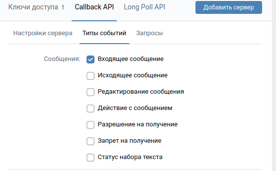

# vkbot

в файле **application.properties** задайте необходимые свойства:

server.port=порт на котором будет работать приложение

vk.token = ключ доступа вк

vk.version = версия апи вк, рекомендуется (5.89) тестировалось на ней

vk.webhook=адрес сервера, например https://2ca0-171-25-167-54.ngrok.io

После запуска приложения перейдите в настройки сервера вк и поставьте галочку Входящие сообщения:

